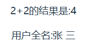
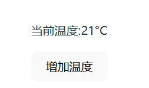
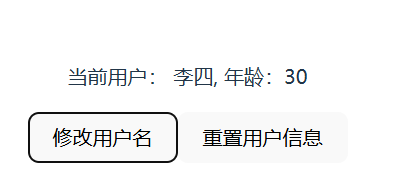

# VUE3基础

### 1.安装VUE + Ts项目

在创建Vite项目之前，需要先安装Vite

```bash
npm install -g create-vite
```

接着使用 `npm create vite@latest`初始化项目,输入项目名称后选择Vue和TypeScript。选择后，Vite会自动生成一个项目模板。

也可以在命令行中直接制定具体项目格式

```bash
npm create vite@latest my-vue -- --template vue
```

最后使用 `npm intall`安装依赖就可以运行 `npm run dev`启动开发服务器了

通常会在 `http://localhost:5173`上运行

### 2.模板语法

#### 2.1声明式渲染


创建一个template组件


将其导入App.vue中,这样元素组件就被嵌入index.html的div中，最后在浏览器上显示


单击这个div元素，触发方法


#### 2.2组件系统

组件的代码结构从整体上来看可以分为3个区域

1. `<template></template>`：模板区域，基于HTML，声明式地绑定数据，表示⻚面结构；
2. `<script></script>`: 脚本区域，提供主要的数据和方法等;
3. `<style></style>`:样式区域，用来修饰模板的样式.

### 3.Vue.js的基础概念

#### 3.1插值语法


`{{}}`可以动态的显示其中变量的值


也可以插入js表达式



#### 3.2属性绑定

使用 `v-bind`可以绑定一个元素的属性的值到变量上，借此操控该元素属性,`v-bind`也可以简写成 `:`


也可以一次性将多个属性动态绑定到元素上，这通常通过一个对象来实现


`v-bind`也可以绑定class和style，动态的切换类和样式


点击按钮后切换类名，更换样式


通过绑定元素的style来操纵样式


`v-bind`也可以绑定自定义属性到任意html元素


运行结果如下


#### 3.3状态和方法

状态是组件内部存储和管理的数据，它在组件生命周期内变化，并驱动视图的更新。

状态可以通过`ref`或`reactive`进行定义

* `ref`:用于基本数据类型以及简单对象,并通过 `.value`来访问包装的值
* `reactive`:适用于复杂对象（如数组、对象),`reactive`将整个对象转换为响应式的，当对象的任一属性发生改变时，Vue会自动追踪这些变化

使用ref定义一个简单状态


通过按钮修改状态后，vue会自动更新视图

使用reactive定义复杂对象状态


修改对象中任意属性的值，vue都会自动更新视图


方法是组件中用来处理业务逻辑、响应事件或对状态进行修改的函数.

在Vue3的 `<script setup>`中，方法通常是以函数的形式定义，可以直接修改组件的状态或执行其他操作。结合TypeScript，可以为方法指定参数和返回值的类型，确保代码的安全性和可读性。

定义一个无参数的方法




使用箭头函数来定义一个方法，并使用：指定方法的返回值，该方法通过操作`temperature.value`来增加温度，Vue自动处理视图更新

定义一个带参数的方法


在箭头函数的（）内定义方法参数并使用：制定参数类型，方法通过参数控制`count`增加的值，使其更加灵活

通常状态和方法是紧密结合的，方法通过操作状态来改变组件的行为或显示的内容





`changeName`方法接受一个`newName`参数来动态修改用户名

`resetUser`方法重置用户信息，将用户数据恢复到初始状态

#### 3.4条件渲染与列表渲染

条件渲染指的是根据某些条件，决定是否渲染某个 DOM 元素

`v-if`可以在条件为true时渲染元素，而 `v-else`和 `v-else-if`可以扩展条件，为多个条件分支提供支持

基本的条件渲染


使用`isVisible`状态来控制文本的显示与隐藏

列表渲染用于根据数组或对象的数据，动态渲染一组元素。

Vue通过`v-for`指令来实现列表渲染。用于遍历数组、对象或指定的次数，生成对应的元素。

遍历数组渲染列表


使用`v-for`遍历`items`数组，并为每个项目生成一个`li`标签；

`:key`是唯一标识符，用于优化Vue的虚拟DOM渲染

遍历对象数组

当我们渲染一个对象数组时，可以通过v-for遍历每个对象，并使用模板语法展示对象的属性.


使用 `v-for`遍历 `users`数组,使用`user`

为数组的元素取名，展示用户的`name`和`age`

使用索引渲染列表


在`v-for`中，可以通过第二个参数获取当前索引

通过`index + 1`来显示每项的序号

在实际项目中，条件渲染和列表渲染经常结合使用。可以根据某些条件决定是否渲染整个列表，或者在列表中根据不同条件渲染不同的内容

根据条件渲染列表中的内容


使用`v-if`和`v-else`根据用户的年龄渲染不同的文本（成人或未成年）
